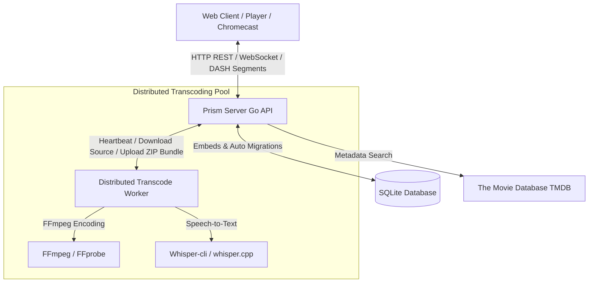

# 🌌 Prism Media Server

<p align="center">
  
</p>

Prism is a high-performance, self-hosted media server built from the ground up for **browser-native MPEG-DASH adaptive bitrate streaming**. Unlike traditional media servers, Prism pre-transcodes media into static, highly cacheable segmented fMP4 streams, delivering instant startup times, smooth adaptive resolution changes, and zero playback-time CPU overhead on the main server.

---

## ⚡ Why Choose Prism over Plex or Jellyfin?

While Plex and Jellyfin are powerful, they rely heavily on **just-in-time (JIT) transcoding**. When multiple users play incompatible video formats, the host CPU spikes to 100%, causing buffering, frame drops, and lag.

Prism takes a modern web-first approach:

1. **True Browser-Native MPEG-DASH**: Media is transcoded beforehand into standardized MPEG-DASH directories containing audio, video, and subtitle streams split into small `.m4s` segments. 
2. **Infinite Scaling via Static Serving**: Because playback simply requests static files, the server serves files with aggressive caching (`Cache-Control: max-age=31536000, immutable`). The server workload shifts from CPU-heavy video encoding to simple static HTTP file delivery, allowing the server to handle dozens of concurrent streams on low-end hardware.
3. **No Playback Buffering**: Seamless adaptive bitrate (ABR) switching automatically drops or increases stream quality depending on the client's network speed without stalling the video.
4. **Distributed Job Execution**: Transcoding and AI speech-to-text workloads can be entirely offloaded from the main application server to lightweight external workers.

---

## 🛠 Architecture

Prism is designed as a modular, low-overhead media platform:

* **Backend**: Written in high-performance Go using the lightweight [router.go](file:///home/benwelker/repos/prism-server/internal/api/router.go) router powered by `go-chi/chi/v5`.
* **Frontend**: A standalone Angular Single Page Application featuring a dark-themed glassmorphism interface and a player powered by `dash.js`.
* **Database**: Embedded pure-Go SQLite ([db.go](file:///home/benwelker/repos/prism-server/internal/store/sqlite/db.go)) running in Write-Ahead Logging (WAL) mode. Auto-migrations run on startup via `pressly/goose/v3`.
* **Transcode Workers**: A distributed queue architecture allowing local or remote workers to process intensive audio/video tasks.

### System Architecture Flow



---

## ✨ Key Features

### 1. Distributed Transcoding Worker Pools
Rather than locking all CPU resources on your main media host, Prism splits transcoding into independent sub-jobs (`video`, `subtitles`, or `whisper`).
* **REST & Zip Protocol**: Remote workers run a lightweight agent that registers with the server, polls the heartbeat endpoint `POST /api/v1/workers:heartbeat`, downloads the source video, and streams/uploads a zipped bundle of DASH segments once done.
* **Database-Backed Queue**: Transcode tasks are stored and managed inside SQLite. If a worker goes offline, the server detects the missing heartbeat and re-queues the job.

### 2. AI-Driven Subtitle Alignment
Nothing ruins a movie faster than out-of-sync subtitles. Prism solves this programmatically using speech-to-text:
* **Automatic Whisper Transcription**: When a media item is optimized, Prism can trigger a local Whisper model (`whisper.cpp`) to transcribe the speech into a highly accurate reference VTT file.
* **Histogram Similarity Matching**: When you upload an out-of-sync subtitle file, Prism parses the uploaded VTT and the Whisper reference, strips stop-words, aligns occurrences in a temporal delta histogram, shifts timestamps automatically to resolve the sync offset, and rebuilds the DASH manifest.

### 3. Smart Library Indexing & Deduplication
* **Header Fingerprinting**: The scanner reads only the first 64 KB of a video container to construct a unique hash. If a file is renamed or moved across folders, it is recognized instantly, preserving its TMDB metadata and watch progress.
* **Automatic Relinking**: If a newly added file matches the fingerprint of an existing transcode bundle on disk, the system instantly links it without re-transcoding.

### 4. Chromecast & Google Cast Integration
* Includes a custom, unauthenticated Chromecast CAF (Cast Application Framework) receiver page.
* Features short-lived stream authorization tokens passed securely during cast initialization to prevent unauthorized streaming.

### 5. Well-Documented & Platform-Agnostic REST API
The entire Prism server is designed around a fully-decoupled, documentable REST API and WebSocket events bus.
* **Auto-Generated Swagger Documentation**: The backend API endpoints are annotated and compiled into a Swagger UI specification, accessible at `/docs` when running the server. 
* **Platform-Agnostic Playback & Syncing**: Because the server exposes clean JSON endpoints for user authentication, library scanning, playback progress syncing, and configuration, any client platform can easily integrate with Prism.
* **Client Ecosystem**:
  * Native Android App: [prism-android](https://github.com/prismatic-media/prism-android)
  * TV Web App: [prism-tv-web](https://github.com/prismatic-media/prism-tv-web)
  * Desktop/Browser SPA: Built directly in the server `web/` subdirectory.

---

## 🚀 Getting Started

### Prerequisites
* **Go** (1.21 or later)
* **Node.js & npm** (for building the web dashboard)
* **FFmpeg & FFprobe** (installed on the path for local transcoding)

### Local Development Setup

1. **Install Frontend Dependencies**:
   ```bash
   make web-install
   ```

2. **Run in Development Mode**:
   ```bash
   make dev
   ```
   This will compile the Angular web client into `web/dist/` in development configuration and start the Go server on port `8080`.

3. **Access the Server**:
   Open `http://localhost:8080` in your web browser. You will be greeted by the Setup Wizard.

4. **Default Credentials**:
   If the setup wizard has already run, you can log in with:
   * **Username**: `admin`
   * **Password**: `asdf`

### Running with Docker Compose

Prism can be launched inside Docker containers using the provided [docker-compose.yml](file:///home/benwelker/repos/prism-server/docker-compose.yml):

```bash
docker-compose up --build -d
```
The application will mount `./dev-media` to `/media` inside the container for scanning.

---

## ⚙️ Configuration Reference

Startup variables can be configured using command-line arguments or environment variables:

| Parameter | Environment Variable | Default Value | Description |
|---|---|---|---|
| `--db` | `PRISM_DB` | `prism.db` | Path to the SQLite database file |
| `--port` | `PRISM_PORT` | `8080` | Port for the HTTP API server |

### Runtime Settings (Stored in Database)
All other configuration keys are managed directly from the Web Admin dashboard:
* `thumbs_dir`: Path where poster graphics and stills are cached.
* `transcode_workers`: Number of concurrent transcoding threads for the local worker. Set to `0` to disable the local transcoder and rely entirely on external distributed workers.
* `whisper_enabled`: Toggle automatic speech-to-text transcript generation.
* `whisper_model`: The size/type of the Whisper model (`tiny`, `base`, `small`, etc.).
* `tmdb_api_key`: API key for automated movie/TV metadata enrichment.

---

## 🤝 Contribution & Commands

We welcome contributions! Use the provided [Makefile](file:///home/benwelker/repos/prism-server/Makefile) to build and run test commands:

* `make build` — Compiles the production production bundle of the web frontend and builds the Go binary.
* `make test` — Runs Go unit tests across all packages.
* `make lint` — Checks for common Go mistakes using `go vet`.
* `make clean` — Removes binary artifacts and build outputs.
* `make reset` — Deletes all cache files, transcode segment storage, and test database files.
* `make swagger` — Regenerates Swagger API annotations using `swag init`.
