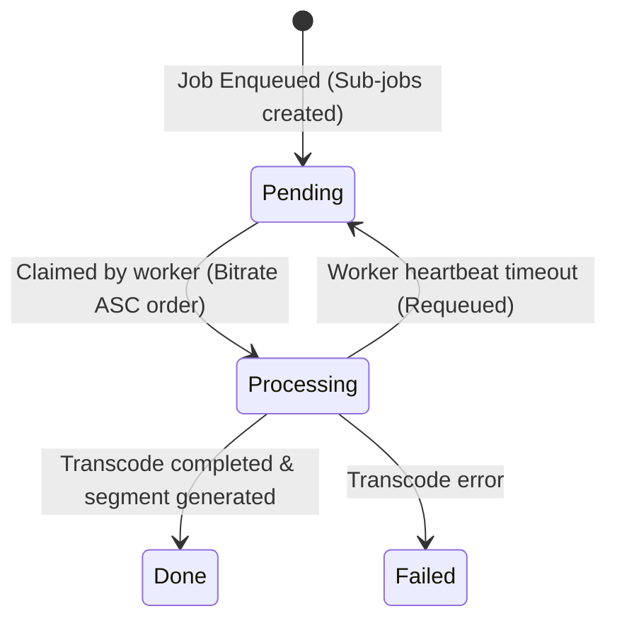

# Phase 1 Data Model: Transcode Bitrate Priority

## Schema & Entities

### 1. `transcode_sub_jobs` (Table)

Represents a single sub-job task within a parent transcode job.

| Column | Type | Description |
| --- | --- | --- |
| `id` | `TEXT` (UUID) | Primary Key |
| `job_id` | `TEXT` (UUID) | Foreign Key to `transcode_jobs.id` |
| `worker_id` | `TEXT` (UUID, nullable) | Claiming worker ID |
| `type` | `TEXT` | Sub-job type (`video`, `subtitles`, `whisper`) |
| `profile_id` | `TEXT` (nullable) | Transcode profile ID (e.g. `360p`, `720p`) |
| `profile_name` | `TEXT` (nullable) | Human readable profile name |
| `width` | `INTEGER` (nullable) | Target video width |
| `height` | `INTEGER` (nullable) | Target video height |
| `video_bitrate_k` | `INTEGER` (nullable) | **Key field for priority ordering**: Target video bitrate in kbps |
| `audio_bitrate_k` | `INTEGER` (nullable) | Target audio bitrate in kbps |
| `codec` | `TEXT` (nullable) | Video codec (e.g., `libx264`) |
| `status` | `TEXT` | Sub-job state (`pending`, `processing`, `done`, `failed`) |
| `progress` | `REAL` | Processing progress percentage (0.0 – 100.0) |
| `error_msg` | `TEXT` (nullable) | Error details if failed |
| `started_at` | `TEXT` (RFC3339) | Timestamp when claimed |
| `finished_at` | `TEXT` (RFC3339) | Timestamp when completed |
| `created_at` | `TEXT` (RFC3339) | Timestamp when created |

---

### 2. `transcode_jobs` (Table)

Represents the parent transcode job for a media item.

| Column | Type | Description |
| --- | --- | --- |
| `id` | `TEXT` (UUID) | Primary Key |
| `media_item_id` | `TEXT` (UUID) | Foreign Key to `media_items.id` |
| `status` | `TEXT` | Parent job status (`pending`, `processing`, `done`, `failed`) |
| `priority` | `INTEGER` | Job priority rank |
| `created_at` | `TEXT` (RFC3339) | Enqueue timestamp |

---

## Sub-Job Dispatch Priority Logic

When worker processes claim sub-jobs via `ClaimNextSubJob`, candidate sub-jobs in state `pending` are evaluated and ordered by:

```sql
ORDER BY 
    pinning_category ASC,                 -- 1: Pinned worker matching, 2: Unclaimed
    priority DESC,                        -- Parent job priority (highest first)
    created_at ASC,                       -- Parent item enqueue order (FIFO)
    COALESCE(season_number, 0) ASC,       -- TV Show season order
    COALESCE(episode_number, 0) ASC,      -- TV Show episode order
    type DESC,                            -- Non-video / sidecars first
    COALESCE(video_bitrate_k, 0) ASC,     -- Lowest video bitrate sub-job first (NEW)
    sub_job_id ASC                        -- Deterministic fallback tie-breaker
```

---

## State Transition Lifecycle


